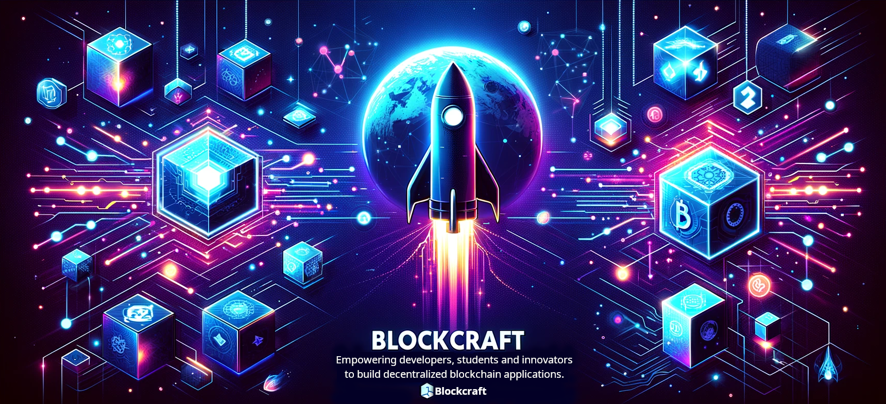

# Blockcraft 🚀

Welcome to the Blockcraft, my blockchain toolkit crafted from scratch to empower developers, innovators, and students. This toolkit is designed for building decentralized applications (dApps) that leverage the full potential of blockchain technology. Starting from the ground up, Blockcraft has been tailored for composition, allowing developers to mix and match different components for consensus mechanisms, incentive models, data handling, and storage, ensuring flexibility and customization in building blockchain applications.

## Key Features

🚀 **From Scratch to Advanced**: Developed from the ground up with a focus on composability, Blockcraft is not just another blockchain toolkit. It's an extensible solution for crafting blockchain apps.

🔧 **Modular and Flexible**: Emphasizing flexibility, Blockcraft features a modular design that allows developers to integrate and customize components seamlessly, fitting nicely into various blockchain application scenarios.

🔒 **Built-in Security**: Blockcraft employs advanced security protocols to ensure robust blockchain, transaction and data integrity, providing a solid foundation for trust and reliability.

🌐 **Support for Decentralized Networks (dApps)**: Designed to foster decentralized applications, Blockcraft comes with full support for creating and managing peer-to-peer networks, enabling direct and secure transactions and interactions.

🛠 **All-In-One Toolkit**: From consensus algorithms to peer-to-peer services, Blockcraft provides a full array of tools needed to design, deploy, and manage innovative blockchain applications efficiently.

## Getting Started 🛠️

Dive into the world of blockchain development with Blockcraft by following these setup instructions:

**Installation**

```bash
npm install github:chrisallenarmbruster/blockcraft
```

## Usage 🔍

Blockcraft is designed to empower developers with the flexibility to build customizable and efficient blockchain systems. At the core of Blockcraft's design is the separation of concerns, allowing developers to mix and match different components for consensus mechanisms, incentive models, data handling, and storage. This section will guide you through using these features to set up a comprehensive blockchain solution.

### The Blockchain Class 💾

The `Blockchain` class is the heart of your blockchain application, orchestrating the interaction between various components. It is initialized with several key parameters that define its behavior:

🤝 **Consensus Mechanism**: Determines how consensus is achieved on the blockchain. Blockcraft allows for the integration of various consensus mechanisms, enabling you to choose or develop one that best fits your application's requirements.

🏅 **Incentive Model**: Defines the strategy for rewarding network participants. This modular approach lets you implement a custom incentive model that motivates participation in your blockchain network.

📊 **Data Handler**: Manages the processing and storage of data within blocks. By customizing the data handler, you can tailor how data is treated, validated, and stored on your blockchain.

🗃️ **Storage Handler**: Controls how blockchain data is persisted. Whether you're using file systems, databases, or other storage solutions, the storage handler ensures your blockchain data is securely saved and retrievable.

⚙️ **Configuration Object**: A flexible configuration object allows you to fine-tune the settings and parameters of your blockchain, such as block size limits, transaction fees, and network protocols.

```javascript
const blockchain = new Blockchain(
  new ProofOfWorkConsensus({ ...cmConfig }),
  new StandardMiningReward({ ...imConfig }),
  new DataHandler({ ...dhConfig }),
  new StorageHandler({ ...shConfig }),
  { ...bcConfig }
);
```

### The NetworkNode Class 🌍

For blockchain networks to function, nodes must communicate and synchronize with each other. The `NetworkNode` class encapsulates the network layer, integrating:

🔄 **P2P Service**: Manages peer-to-peer communication between nodes, ensuring data is shared efficiently across the network without relying on a central server.

🌐 **Web Service**: Provides an HTTP interface for your blockchain, allowing external applications and users to interact with the blockchain via web requests.

The `NetworkNode` class takes an instance of your `Blockchain`, along with instances of the P2P service and Web service, fully encapsulating the networking functionality and allowing your blockchain to operate within a distributed network.

```javascript
const networkNode = new NetworkNode(
  blockchain,
  new P2PService({ ...p2pConfig }),
  new WebService({ ...wsConfig }),
  { ...nnConfig }
);
```

### Example & Demo 📝

For a comprehensive example, see the [Blockcraft Cryptocurrency Demo](https://github.com/chrisallenarmbruster/blockcraft-coin-demo).

This demo showcases how to create a simple cryptocurrency using Blockcraft, demonstrating the integration of the `Blockchain` and `NetworkNode` classes, along with a proof of work consensus mechanism, mining incentive, data handling, persistent storage, P2P and web service components. It provides the ability to create a blockchain, mine blocks, send transactions, and spin up a single network node or multiple nodes to form a decentralized network.

By following this example, you can learn how to build a fully functional decentralized blockchain application using Blockcraft.

You can interact with the demo through its web interface: [Explorer Frontend](https://node1.blockcraft.rev4labs.com) and [Blockcraft Vault Wallet](https://vault.blockcraft.rev4labs.com).

### Flexibility and Customization 🤸‍♂️

The separation of concerns within Blockcraft not only ensures cleaner code and easier maintenance but also enables flexibility . Developers can create and swap out consensus mechanisms, experiment with different incentive models, customize data handling logic, and choose their preferred method of data storage without altering the core blockchain logic. The same is true for creating dApp nodes for hosting blockchains, allowing peer-to-peer services and web interfaces to be switched. This design philosophy encourages innovation and experimentation, enabling the creation of a blockchain that perfectly fits each developer's unique requirements.

## Final Thoughts 🚀

Blockcraft's modular architecture is designed with developers and students in mind, offering the building blocks to create, customize, and scale blockchain applications. By understanding and utilizing the core components of Blockcraft—`Blockchain` and `NetworkNode` classes, along with their associated services and handlers, Blockcraft enables solutions that are tailored to each application's needs.

## Engineers

### [🧑 Chris Armbruster](https://github.com/chrisallenarmbruster)

## License

Copyright (c) 2024 Chris Armbruster

This project is MIT licensed.
